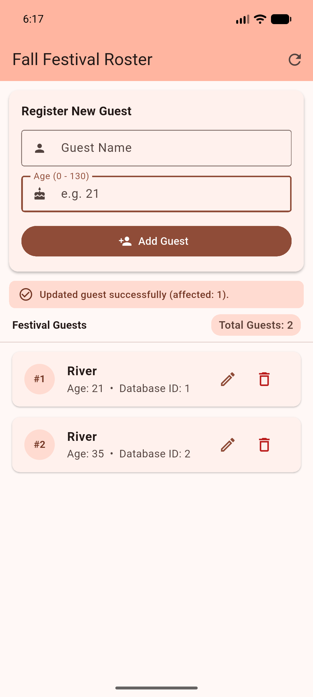
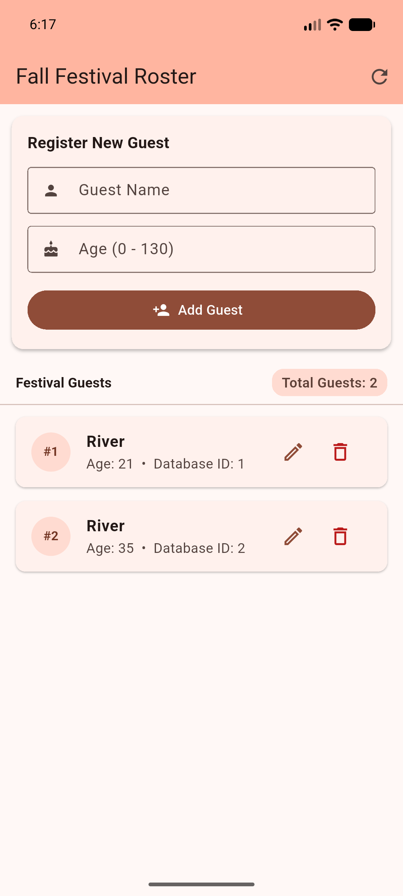
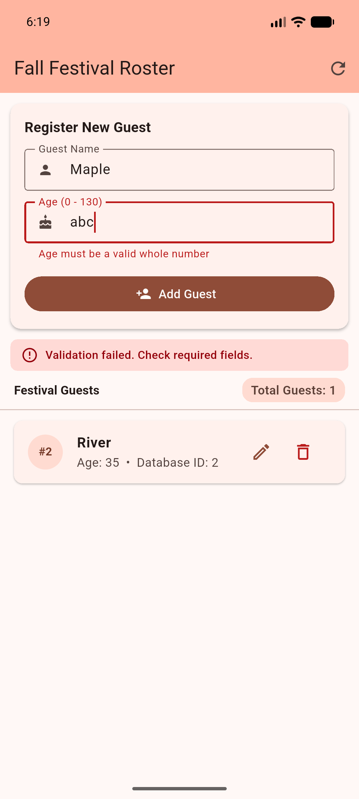

# In-Class 08 / Fall Festival Roster

- **Student / course / pathway**: Adi Tauqir / Mobile Application Development (In-Class 08 / Section 2) / Undergraduate
- **GitHub Repository**: [https://github.com/aditauqir/In-Class-Activity-08](https://github.com/aditauqir/In-Class-Activity-08)
- **Flutter / Dart versions; device / OS**: Flutter 3.47.2 • Dart 3.13.2 / sdk gphone16k arm64 (emulator-5554), Android 17 (API 37)
- **Setup/run commands**:
  ```bash
  flutter pub get
  flutter run -d emulator-5554
  ```

## Storage notes
- **Schema and initialization**: The database table `my_table` is declared in `lib/database_helper.dart` with schema `_id INTEGER PRIMARY KEY, name TEXT NOT NULL, age INTEGER NOT NULL`. Initialization occurs asynchronously in `main()` via `WidgetsFlutterBinding.ensureInitialized()` and `await helper.init()`, locating the device application documents directory (`getApplicationDocumentsDirectory()`) and opening `MyDatabase.db` (creating it via `_onCreate` if not present). The database instance is passed down to `DirectoryApp` and `RosterScreen`.
- **Input policy, IDs, CRUD source locations**:
  - Name is trimmed and validated non-empty; age is parsed using `int.tryParse()` and enforced to integer range `0 <= age <= 130`.
  - SQLite auto-assigns primary key `_id` on insert. All edit/update and delete operations target records strictly by their integer `_id` primary key (`where: '_id = ?', whereArgs: [id]`).
  - CRUD source locations:
    - Helper methods in `lib/database_helper.dart`: `insert()` (L45-47), `queryAllRows()` (L51-53), `queryRowCount()` (L57-60), `update()` (L64-72), `delete()` (L76-82).
    - UI integration in `lib/main.dart`: `_loadData()` (L76-102), `_saveGuest()` (L140-237), `_startEdit()` (L239-251), `_cancelEdit()` (L253-260), `_confirmDelete()` (L262-368).
- **Memory example / preference example / SQLite example**:
  - *Memory state*: The transient `_nameController.text`, `_isBusy` boolean flag, and active edit state `_selectedId` in RAM (discarded on app termination).
  - *Key-value preferences*: A lightweight flag such as `SharedPreferences` storing whether the user enabled dark mode or the festival theme.
  - *SQLite records*: The durable structured rows in `my_table` containing `_id`, `name`, and `age` stored in `MyDatabase.db` on disk across device restarts.

## Actual tests

| Test | Action/input | Expected | Observed IDs/ages/count | Pass/fail |
| --- | --- | --- | --- | --- |
| T1 | Refresh roster after confirming zero initial rows | Count 0, empty-state message | Total Guests: 0, "No festival guests yet" displayed | Pass |
| T2 | Add "River", age 21; Add "River", age 34 | Count 2; distinct generated IDs A and B | Count 2; Guest #1 (River, 21), Guest #2 (River, 34); IDs A=1, B=2 | Pass |
| T3 | Edit B (#2) to 99, tap Cancel Edit; Edit B again to 35, tap Save Changes | Cancel leaves B at 34; Save returns affected: 1, count 2; A stays 21, B becomes 35 | Cancel: B remained 34, count 2; Save: affected: 1, A=1 (age 21), B=2 (age 35), count 2 | Pass |
| T4 | Force stop app process and relaunch same installation without clearing data | Same IDs, names, ages, count (2); no reseeding | Count 2; Guest #1 (River, 21), Guest #2 (River, 35) restored intact from SQLite | Pass |
| T5 | Tap Delete on A (#1), tap Cancel; tap Delete on A again, tap Confirm Delete, then Refresh | Cancel leaves count 2; confirm returns affected: 1; after Refresh only B (#2) remains, count 1 | Cancel: count 2; Delete: affected: 1; Roster contains only Guest #2 (River, 35), Total Guests: 1 | Pass |
| T6 | Five invalid attempts in Add mode:<br>1. Name "   " (spaces), age 21<br>2. Name "Maple", age "abc"<br>3. Name "Maple", age "1.5"<br>4. Name "Maple", age "-1"<br>5. Name "Maple", age "131"<br>Two valid boundary additions:<br>6. Name "Acorn", age 0<br>7. Name "Oak", age 130 | 1. Error: "Name cannot be blank", count 1<br>2. Error: "Age must be a valid whole number", count 1<br>3. Error: "Age must be a valid whole number", count 1<br>4. Error: "Age must be between 0 and 130 inclusive", count 1<br>5. Error: "Age must be between 0 and 130 inclusive", count 1<br>6. Accepted with new ID, count 2<br>7. Accepted with new ID, final count 3 | 1. Feedback shown, count 1<br>2. Feedback shown, count 1<br>3. Feedback shown, count 1<br>4. Feedback shown, count 1<br>5. Feedback shown, count 1<br>6. Accepted: ID #3 (Acorn, age 0), count 2<br>7. Accepted: ID #4 (Oak, age 130), count 3 | Pass |

T4 stop/relaunch method:  
On Android emulator (`emulator-5554`), executed `adb shell am force-stop com.example.local_storage_lab` to terminate the process without clearing application data or storage. Then relaunched the application via `adb shell am start -n com.example.local_storage_lab/.MainActivity`.

Evidence:
- `evidence/T4_before.png` (Screenshot showing Roster before restart: Guest #1 River 21, Guest #2 River 35, Total Guests: 2)
- `evidence/T4_after.png` (Screenshot showing Roster after process restart: Guest #1 River 21, Guest #2 River 35, Total Guests: 2 restored)
- `evidence/T6_invalid.png` (Screenshot showing validation feedback on invalid input: Name Maple, Age abc, "Age must be a valid whole number", count 1 unchanged)
- `evidence/analysis_output.txt` (Output of `flutter analyze`: "No issues found!")

### Visual Evidence Screenshots

#### T4 / Before Restart (Guest #1 River 21, Guest #2 River 35, Total Guests: 2)


#### T4 / After Cold Process Restart (State Durably Restored from SQLite)


#### T6 / Validation Feedback on Rejected Input (Name Maple, Age abc, Count Unchanged)


Analyzer command/result; known limitations:  
Command: `flutter analyze 2>&1 | tee evidence/analysis_output.txt`  
Result: `No issues found! (ran in 0.9s)`  
Known limitations: SQLite file is stored locally in the application documents directory without at-rest database encryption or cloud synchronization, which matches the Part 1 scope requirements.

## Short reflections

### 1. Prediction (write BEFORE T4), then actual result/interpretation:
- **Prediction before T4**: Both guest records (ID 1: River, age 21 and ID 2: River, age 35; total count 2) will survive the process termination. This is because SQLite persists data to `MyDatabase.db` on disk, which remains untouched when an Android process is terminated via `am force-stop` (unlike volatile in-memory RAM widget state).
- **Actual result & trace**: When the app relaunched, `main()` executed `WidgetsFlutterBinding.ensureInitialized()` and `await helper.init()`, which reopened `MyDatabase.db`. During `RosterScreen.initState()`, `_loadData()` called `queryAllRows()` and `queryRowCount()`, immediately reconstructing the widget list with both rows (#1 River 21, #2 River 35) and setting count to 2.
- **Disproof observation**: If the screen showed "No festival guests yet" (count 0), or lost the updated age (showing age 34 or blank), that would disprove durable SQLite restoration and indicate reliance on in-memory state or re-initialization reset.

### 2. My two IDs and update result; why identity matters:
- In test T2, both attendees were named "River". The database assigned distinct primary keys: ID 1 for River (21) and ID 2 for River (34).
- In test T3, updating guest B executed `widget.helper.update({ DatabaseHelper.columnId: currentId, ... })` with `where: '$columnId = ?', whereArgs: [id]`. Because `currentId = 2`, SQLite updated exactly 1 affected row. Guest #1 (River, 21) was completely unaffected.
- If we had targeted records by name (`WHERE name = 'River'`), both Rivers would have been updated to age 35. Furthermore, if we targeted by list position (e.g., index `0`), any re-sorting (e.g. sorting by age or name instead of ID) would cause index `0` to point to a different guest, inadvertently overwriting the wrong person's data.

### 3. My self-walkthrough observation and proposed improvement:
- **Screen observation**: During the walkthrough of Add/Edit/Cancel/Delete, when entering Edit mode, the input card title changed to "Edit Guest #2", prefilled the text fields, highlighted the selected card with an accent border, and displayed "Save Changes" and "Cancel Edit". Clicking "Cancel Edit" cleanly reset the form and cleared selection without persisting changes.
- **Proposed improvement & trade-off**: An improvement would be to add an "Undo" `SnackBar` action upon deleting a guest. The trade-off is added complexity: temporary soft-deletion or caching deleted row maps in memory, which requires handling edge cases if the app is closed before undo expires.
- **Verification of invalid input**: In T6, attempting space-only names, strings, decimals, and negative/excessive numbers immediately raised field-level error text ("Name cannot be blank", "Age must be a valid whole number", "Age must be between 0 and 130 inclusive") and the count remained locked at 1. No write calls were executed.

### 4. Graduate only: validation/schema design reasoning:
*(N/A - Undergraduate pathway)*

## Attribution
- Starter code: Provided `database_helper.txt` and `sample yaml/pubspec.yaml` from course materials (In-Class Activity 08, CS/MAD).
- Documentation consulted: [Flutter SQLite cookbook](https://docs.flutter.dev/cookbook/persistence/sqlite) and [sqflite documentation](https://pub.dev/packages/sqflite).
- AI assistance: GitHub Copilot used for light syntax nudges and assistance with database queries (SQLite update/delete where-clause parameter mapping) and input validation logic.
